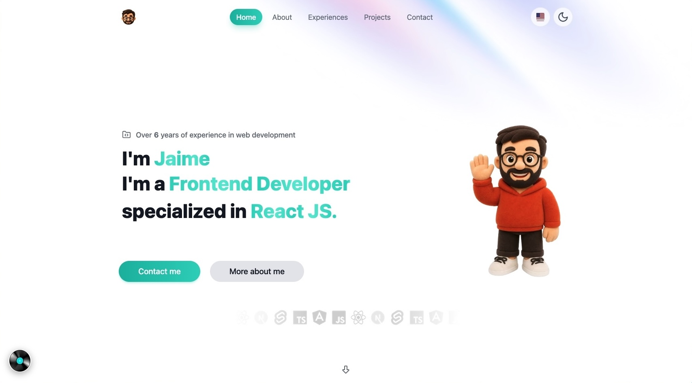

<h1 align="center">Hi, I'm Jaime 👋</h1>

  <b>Frontend Developer</b> from Colombia 🇨🇴 · 6+ years building scalable, high-performance web apps.

  
  

---

### My favorite projects

  
  
  

---

### 📫 Let's connect

Have a project in mind or want to talk frontend? Reach out through my
<a href="https://jaimetorresv.com/contact" target="_blank">portfolio</a> or on <a href="https://linkedin.com/in/jaimetorresv" target="_blank">LinkedIn</a>. Always happy to talk tech! 🤙
